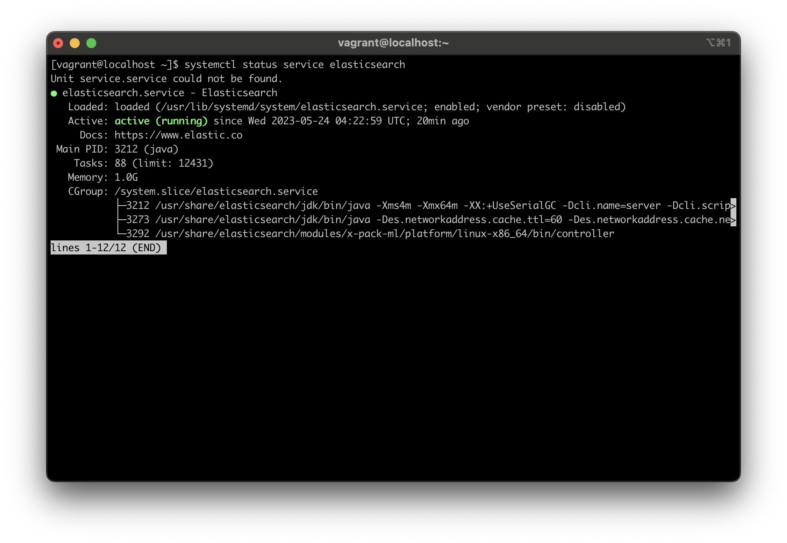

# P2P Decentralized Observability

This project contains all the configuration to set up observability for P2P Decentralized
Application

**High Level Architecture System Design**


## Table of Contents

- [Prerequisites](#prerequisites)
- [Manual Installation](#manual-installation)
  - [I. Java](#i-install-java)
  - [II. Elasticsearch](#ii-install-elasticsearch)
  - [III. Kibana](#iii-install-kibana)
  - [IV. APM Server](#iv-install-apm-server)
  - [V. Fluentbit](#v-install-fluentbit)
  - [VI. AIO Installation Script](#vi-aio-installation-script)
- [Usage](#usage)
- [Contributing](#contributing)
- [License](#license)

## Prerequisites

- `java 11+`
- `elasticsearch`
- `kibana`
- `fluentd`
- `apm-server`
- `vagrant` (**Optional -- used for local setting**)

## Manual Installation

### I. Install java

**Troubleshooting**
Fix `Error: Failed to download metadata for repo ‘AppStream’: Cannot prepare internal mirrorlist: No URLs in mirrorlist`

```shell
cd /etc/yum.repos.d/
sudo sed -i 's/mirrorlist/#mirrorlist/g' /etc/yum.repos.d/CentOS-*
sudo sed -i 's|#baseurl=http://mirror.centos.org|baseurl=http://vault.centos.org|g' /etc/yum.repos.d/CentOS-*
sudo yum update -y
```

#### 1. Install `sdkman`

**Note** Sdkman is a tool to manage multiple java versions in the same machine

Install `zip`

```shell
sudo yum install zip -y
```

Install sdkman

```shell
curl -s "https://get.sdkman.io" | bash
```


Open new terminal and execute script below to complete installation

```shell
source "$HOME/.sdkman/bin/sdkman-init.sh"
```

Run command to verify sdkman is installed successfully

```shell
sdk version
```


#### 2. Install `java`

Execute command to install java

```shell
sdk install java 20-amzn
```


### II. Install `elasticsearch`

Download and install the public signing key of Elastic Stack repository

```shell
sudo rpm --import https://packages.elastic.co/GPG-KEY-elasticsearch
```

Create a file with a .repo extension (for example, elastic.repo) in your /etc/yum.repos.d/ directory
and add the following lines

```shell
[elastic-8.x]
name=Elastic repository for 8.x packages
baseurl=https://artifacts.elastic.co/packages/8.x/yum
gpgcheck=1
gpgkey=https://artifacts.elastic.co/GPG-KEY-elasticsearch
enabled=1
autorefresh=1
type=rpm-md
```

**Note:** If you don't have any text editor installed in your system, you can install `Vim`

```shell
sudo yum install -y vim-enhanced
```

Install `elasticsearch`

```shell
sudo yum install elasticsearch -y
```


Enable `elasticsearch` to start automatically when system starts

```shell
sudo systemctl daemon-reload
sudo systemctl enable elasticsearch.service
```

Start `elasticsearch` service by executing

```shell
sudo systemctl start elasticsearch.service
```

Verify `elasticsearch` service started successfully

```shell
systemctl status service elasticsearch
```



Reset default generated password of elasticsearch superuser `elastic`

```shell
sudo /usr/share/elasticsearch/bin/elasticsearch-reset-password -u elastic
```


### III. Install Kibana

Install `kibana`

```shell
sudo yum install kibana -y
```


Enroll `kibana` token

```shell
sudo /usr/share/elasticsearch/bin/elasticsearch-create-enrollment-token -s kibana
```


Enable `kibana` to start automatically when system starts

```shell
sudo /bin/systemctl daemon-reload
sudo /bin/systemctl enable kibana.service
```

Start `kibana`

```shell
sudo systemctl start kibana.service
```

Verify `kibana` started successfully

```shell
systemctl status service kibana
```


### IV. Install `APM Server`

Install APM Server

```shell
sudo yum install apm-server -y
```


Enable `apm-server` to start automatically when system starts

```shell
sudo /bin/systemctl daemon-reload
sudo /bin/systemctl enable apm-server.service
```

Start apm-server

```shell
sudo systemctl start apm-server.service
```

Verify `apm-server` start successfully

```shell
systemctl status service apm-server
```


### V. Install `Fluentbit`

We provide fluent-bit through a Yum repository. In order to add the repository reference to your
system, please add a new file called fluent-bit.repo in /etc/yum.repos.d/ with the following
content:

```shell
[fluent-bit]
name = Fluent Bit
baseurl = https://packages.fluentbit.io/centos/$releasever/
gpgcheck=1
gpgkey=https://packages.fluentbit.io/fluentbit.key
repo_gpgcheck=1
enabled=1
```

Install `Fluentbit`

```shell
sudo yum install fluent-bit -y
```


Enable `Fluentbit` to start automatically when system starts

```shell
sudo /bin/systemctl daemon-reload
sudo /bin/systemctl enable fluent-bit.service
```

Start `Fluentbit`

```shell
sudo systemctl start fluent-bit
```

Verify `Fluentbit` already started


### VI. AIO installation script

All in one installation script

```shell
bash ./scripts/setup.sh
```

## Containers installation

## Usage

## Contributing

Pull requests are welcome. For major changes, please open an issue first
to discuss what you would like to change.

Please make sure to update tests as appropriate.

## License

[Nevel.tech](/)
