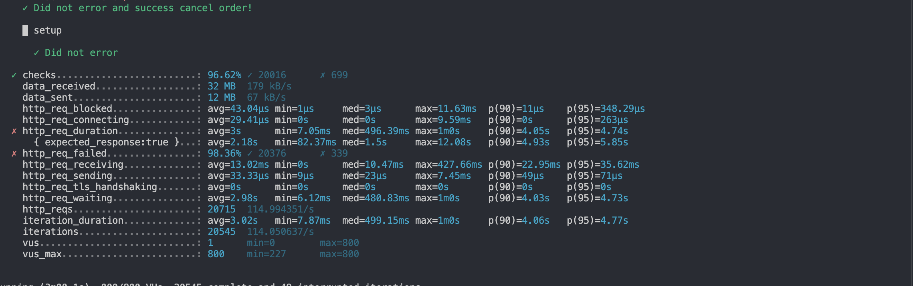

# K6 testing

## Yêu cầu

- `k6`
- `yarn`
- `node v16+`

## Setup

### 1. Get env

Bạn cần copy file `.example.example` (ở root folder) và đổi tên thành `.env`.
Bạn có thể thay đổi các tùy chọn trong file `config.js`.

### 2. Install dependencies

```shell
yarn install
```

## Cấu hình kịch bản test

Có thể cấu hình kịch bản test trong file `config.js`.

Ví dụ:

```javascript
stages: [
  { duration: '10s', target: 100 }, // below normal load
  { duration: '1m', target: 100 },
  { duration: '10s', target: 1400 }, // spike to 1400 users
  { duration: '3m', target: 1400 }, // stay at 1400 for 3 minutes
  { duration: '10s', target: 100 }, // scale down. Recovery stage.
  { duration: '2m', target: 100 },
  { duration: '10s', target: 0 },
];
```

Ghi chú:

- duration: thời gian
- target: số lượng user ảo (Virtual Operation)
- VUs: Số lượng Vus đồng thời

Kịch bản test trên bắt đầu với khoảng thời gian 1 phút và 100 user ảo, tăng đột biến nhanh đến 1400 user ảo duy trì trong 3 phút,
sau đó trở lại 100 user ảo để kiểm tra khả năng phục hồi của server.

## Run scripts for Testing

### 1. Create Post

```shell
node -r ts-node/register index.ts --api-url="<API-URL>" --max-user-credential=800 --create-post-target=500 --scripts="create-post.js"
```


### 2. Search Post

```shell
node -r ts-node/register index.ts --api-url="<API-URL>" --max-user-credential=800 --search-post-target=500 --scripts="search-post.js"
```


### 3. Create Order

```shell
node -r ts-node/register index.ts --api-url="<API-URL>" --max-user-credential=800 --create-order-target=500 --scripts="create-order.js"
```



### 4. Create appeal

```shell
node -r ts-node/register index.ts --api-url="<API-URL>" --max-user-credential=800 --create-appeal-target=500 --scripts="create-appeal.js"
```


---

### Tham khảo

- [K6 - Stress testing](https://k6.io/docs/test-types/stress-testing)
- [K6 - Options](https://k6.io/docs/using-k6/options)
- [K6 - Results output](https://k6.io/docs/getting-started/results-output)
- [K6 - Environment variables](https://k6.io/docs/using-k6/environment-variables)
- [K6 - use InfluxDB + Grafana for results visualization](https://k6.io/docs/results-visualization/influxdb-+-grafana)
- [K6 - Stress testing](https://k6.io/docs/using-k6/options)
